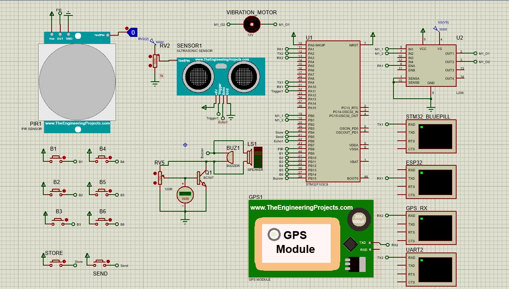

# Path Star: Smart Stick for the Visually Impaired

## Project Overview

Path Star is an innovative smart stick designed to assist the visually impaired. It integrates multiple features such as obstacle detection, GPS, Braille input to enhance the mobility and independence of its users, and Receiving messages to do actions based on them.

## Features

1. *Obstacle Detection*: Utilizes an ultrasonic sensor in input capture mode using timer 4 to detect obstacles and provides feedback via a motor and buzzer.
2. *GPS Navigation*: Provides real-time location data and navigation assistance.
3. *Braille Input*: Allows the user to input characters using a Braille keypad and sends the input via UART, then if possible we send this data to an AI model that can understand what the user wants and convert the words into speech also (For example we can press G to send our location and the time to the AI model so that it can tell the user his location and take from him the destination to go then tell him the best route to take).
4. *PIR Sensor*: Detects nearby motion and triggers the vibration motor accordingly.

## Hardware Components

- STM32 Microcontroller
- Ultrasonic Sensor (HCSR04)
- Vibration Motor (I used DC instead as proteus doesn't have a library for it)
- Buzzer
- GPS Module
- PIR Sensor
- Braille Keypad
- UART Communication
- ESP32 for sending the data over Wifi or Bluetooth

## Code Overview

### Main Functions

```c
Sys_Init(void);
```
Initializes the ultrasonic sensor, motor, and buzzer.
```c
PIR_Response(void);
```
Handles the response of the PIR sensor.
```c
Ultraonic_Response(float distance1);
```
Manages the response based on the ultrasonic sensor's readings.
```c
Read_Buttons(void);
```
Reads the state of the Braille keypad buttons.
```c
Translate_Braille(uint8_t braillePattern, bool *isNumber);
```
Translates the Braille pattern to a corresponding character.
```c
Store_Character(void);
```
Stores the translated Braille character.
```c
Send_Sentence(void);
```
Sends the composed sentence via UART.
```c
Send_Braille(void);
```
Handles the Braille input process.
```c
Check_Password(void);
```
Verifies the password input.
```c
Send_GPS_Data(void);
```
Sends GPS data over UART.
```c
UART_Receiving_IT_Init(void);
```
Initializes UART receiving in interrupt mode.
```c
UART_SendString(UART_HandleTypeDef *huart, char *string);
```
Sends a string over UART.
```c
HAL_UART_RxCpltCallback(UART_HandleTypeDef *huart);
```
Callback function for UART receive complete interrupt.

### Peripheral Initialization

```c
MX_GPIO_Init();
```
Initializes GPIO pins.
```c
MX_USART1_UART_Init();
```
Initializes UART1.
```c
MX_USART2_UART_Init();
```
Initializes UART2.

- The initialization of the timers is inside the initialization functions of the ultrasnoic & the motor.

### Sensor and Motor Control

```c
HCSR04_Read(uint8_t sensor);
```
Reads the distance from the ultrasonic sensor.
```c
DC_MOTOR_Start(uint8_t motor, uint8_t direction, uint16_t speed);
```
Starts the DC motor.
```c
DC_MOTOR_Stop(uint8_t motor);
```
Stops the DC motor.
```c
Buzzer_ON();
```
Turns on the buzzer.
```c
Buzzer_OFF();
```
Turns off the buzzer.

## Usage Instructions

1. *Power On*: Turn on the device and wait for the system initialization.
2. *Enter Password*: Use the Braille keypad to enter the password and press the store and send buttons to verify.
3. *Obstacle Detection*: The device will automatically detect obstacles and provide feedback.
4. *Braille Input*: Use the Braille keypad to input characters and send messages via UART.
5. *GPS Navigation*: GPS data will be sent automatically when required.
6. *PIR detection*: For detecting motion and alerts the user if there someone inside a room for example

## Contributions

Feel free to contribute to the Path Star project by submitting pull requests or reporting issues on the project repository.
It will be a good manner if you want to contribute with an AI model for making this project more advanced and so make the life of the Visually Impaired easier.


## Simulation

You can see here the simulation and if you pressed the img you can find the video of the simulation on my channel on YouTube.

[](https://youtu.be)

